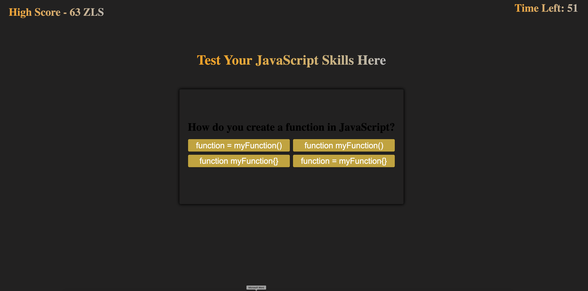

# JavaScript-Quiz-Game
A quiz with built in logic to test your knowledge of JavaScript 

Highscores and user initals are saved upon entering initials and clicking submit on input box 

Score and initial will be displayed upon refresh. 

## Screenshot 
### Screenshot upon launching 

### Screenshot at start of game 

### Screenshot at end of game 

UPDATE THIS 
## Deployed Website Link 
https://zaksalazar.github.io/JavaScript-Quiz-Game/